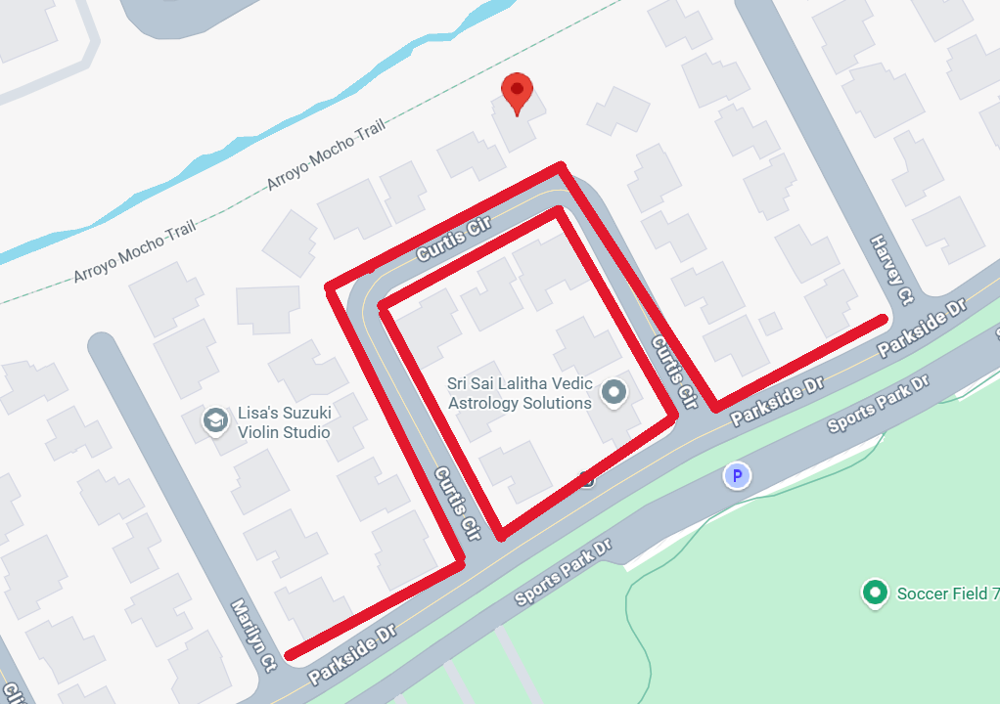

# Reception

[TOC]

## When

Sunday, December 21th 2025

1 PM - 8 PM

## Where

**Dee Dee and Tom Gray's House[^1]**

[3235 Curtis Circle, Pleasanton, CA 94588](https://maps.app.goo.gl/EsG6RCMkH7zc42Vq5)

<iframe src="https://www.google.com/maps/embed?pb=!4v1758487260002!6m8!1m7!1sVqR8-NwOftx_0G4Ga3D1XA!2m2!1d37.68269831177216!2d-121.8941225536029!3f339.59805!4f0!5f0.7820865974627469" width="600" height="450" style="border:0;" allowfullscreen="" loading="lazy" referrerpolicy="no-referrer-when-downgrade"></iframe>

## What

We are fortunate enough that Cam’s Aunt and Uncle, Dee Dee and Tom Gray, have opened their home for our wedding reception. We are excited to have you all!

Our desire is for our reception to feel like a family party. So for those who live nearby and are only able to visit for a few hours, you’re welcome to come and go. For those who are traveling or just want more time to hang out with us all, you can come for the entire time! There will be plenty of food, games, karaoke, and other fun activities.

## Dress Code

Nice and comfortable winter wear. The reception is not a formal occasion, so please leave your suits and gowns at home! Wear something that you’d wear for a holiday party⁠— nice sweaters and pants. The reception will take place both indoors and outdoors, so bring layers just in case. There will be heaters, though, so you should never be too cold.

## What to Bring

Celebrating with you is all we want, truly!

[^1]: Cam's aunt and uncle's house was the location of many parties and family get-togethers over the years. Because of the core memories and good feelings associated with this house, we wanted to capture the same feelings of love and warmth for the celebration of our union.

## Getting Here

### BART (Bay Area Rapid Transit)

If you can make it to the East Dublin/Pleasanton BART Station, we will pick you up! We have a number of volunteer drivers that will take you to and from the station and the reception venue throughout the afternoon and evening!

For more information about how to use BART, see the [public transit](../travel/public_transit.md) page.

!!! warning "East Dublin/Pleasanton BART Station"

    Note that there are 2 `Dublin/Pleasanton BART` stations. We will have drivers at only the East station (last stop of the line).

#### Shuttle

For the shuttle, take a right when exiting the BART station towards Pleasanton. Do not go left which goes toward Dublin. The shuttle driver will pick you up in the taxi/ride share pick up/drop off area on the Pleasanton side. 

!!! note "Call or Text The Shuttle Coordinator"

    Please text or call  to facilitate pick up (from BART to reception) or drop off (from reception to BART).

#### From San Francisco

There are multiple entrances into the system, but the most direct ones in the city can be found on Market Street. 

Regardless of the station, you’ll want to take the Blue Line to the East Dublin/Pleasanton station.

### Parking

Feel free to park along Curtis Circle, avoiding blocking driveways. You may also park along Parkside Drive but only on the residential side. You may also park in the parking lot for the park but this will be more inconvenient for you.

Feel free to park where it's marked red (of course avoiding blocking driveways and being mindful of the neighbors).

If you have any issues, please call the Shuttle Coordinator (see [Shuttle](#shuttle) section for the number).